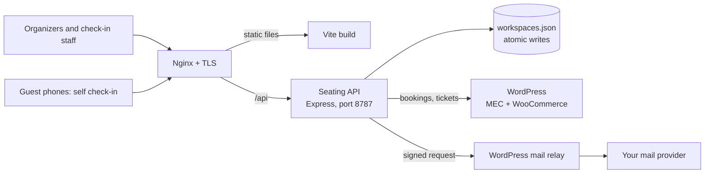

<div align="center">


# Seating Studio

**Plan gala seating, send personal invitations, and check guests in, all from one dashboard.**
Built for ticketed events sold through WordPress, Modern Events Calendar (MEC) and WooCommerce.


[Features](#-features) · [Quick start](#-quick-start) · [Configuration](#%EF%B8%8F-configuration) · [WordPress](#-wordpress-integration) · [Testing](#-testing) · [Deployment](#-deployment) · [Event day](#-event-day-runbook)

</div>

---

## ✨ Features

<table>
<tr>
<td width="50%" valign="top">

### 🪑 Seating

- **Event workspaces** saved on the server and reusable for the next event.
- **Booking sync** imports paid, confirmed attendees from MEC. Seats, check-ins and VIP flags already set are kept.
- **Three linked views**: a zoomable floor plan, table-by-table rosters and a searchable guest register.
- **Drag and drop**, adding several guests at once, and moving or swapping guests between tables.
- **Smart auto-seating** with a live preview before you apply it.
- **Tables and rows**: capacities from 4 to 20, custom row lengths, table numbers and private admin labels.
- **Arrange tables**: drag tables within and between rows, and add new empty tables to any row.
- **Safe for teams**: every save carries the plan version it was based on. If someone else saved first, the save is refused and the tab offers **Reload latest plan** instead of overwriting their work. Open tabs with no unsaved edits pick up other people's changes automatically.
- **Save history**: the server keeps the last 1000 versions of the plan in a `history/` folder next to the data file, so any save can be rolled back.

</td>
<td width="50%" valign="top">

### ✉️ Invitations

- **HTML email editor** with a live desktop and mobile preview.
- **Personal variables**, including table number and a check-in QR code per guest.
- **Guests without a QR code** are told to give their name or email at registration instead.
- **Test emails** through a signed WordPress mail relay or SMTP, with an audit log.
- **Calendar invite** (`.ics`) attached on request.

</td>
</tr>
<tr>
<td valign="top">

### ✅ Check-in

- **Staff desks** with search, live arrival counts, undo, and safe use from several desks at once.
- **Camera QR scanning** of ticket and invoice codes, with manual search as fallback.
- **Check-in-only staff accounts**, managed by administrators.
- **Guest self check-in** per event at `/self-check-in/<event>`, by registration email with an optional emailed code. The guest's phone shows their table.

</td>
<td valign="top">

### 📤 Exports

- **CSV** of the guest register.
- **Printable seating plan** with a vector floor map and room totals.
- **Excel workbook** with Seating, Tables and Guests A–Z sheets and an optional cover page.
- **Membership labels** for purchasers, from Ultimate Membership Pro.

</td>
</tr>
</table>

### 🧠 Smart seating

`src/smart-seating.js` is a deterministic, tested assignment engine.

| Setting | Options |
|---|---|
| **Company style** | Balanced networking (colleague pairs, no large single-company blocks), company together, or maximum mix |
| **Occupancy** | Fill tables efficiently, or use every table |
| **Priority area** | VIPs and top membership tiers go to the tables you choose |
| **Always respected** | Custom table capacities, manual seats, and spreading senior leadership across tables |

### 🎟️ Who gets imported

A booking is admitted only when MEC marks it active and confirmed **and** its WooCommerce order is settled.

| Order | Result |
|---|---|
| `processing` or `completed` with payment | ✅ Admitted |
| N-Genius `ng-complete` with a payment date | ✅ Admitted |
| Completed with a zero total | ✅ Admitted as complimentary |
| Pending, failed, cancelled, on hold, refunded, negative total, unverified | ⛔ Not admitted |

> [!IMPORTANT]
> MEC Utility's `paid` field comes from `mec_payable` and is **not** proof of payment. Membership is looked up from `mec_order_id` to the WooCommerce customer, never from MEC `user_id` or `post_author`. Those can point at the first attendee instead of the purchaser.

---

## 🏗️ Architecture



---

## 🚀 Quick start

**Requires Node.js 20 or newer.** Node 24 is recommended.

```bash
git clone git@github.com:ahmadtello/seating-studio.git
cd seating-studio
npm install
```

### Option A: demo event in two commands

The QA server starts the API with a temporary 40-table event and a ready-made login.

```bash
# Terminal 1: API on :8787 with sample data. Login is qa-user / qa-password.
ALLOWED_ORIGINS=http://localhost:5173 node tests/qa-ui-server.mjs

# Terminal 2: dashboard
npm run dev
```

Open http://localhost:5173. The data lives in a temporary folder and disappears when you stop the server.

### Option B: your own local instance

1. **Create an administrator login.** The file holds a single `username:bcrypt-hash` line.

   ```bash
   node -e "import('bcryptjs').then(b=>console.log(process.argv[1]+':'+b.default.hashSync(process.argv[2],12)))" admin "choose-a-strong-password" > .auth.htpasswd
   ```

2. **Start the API.**

   ```bash
   SESSION_SECRET="$(node -e "console.log(require('crypto').randomBytes(48).toString('hex'))")" \
   AUTH_FILE=.auth.htpasswd DATA_FILE=data/workspaces.json \
   ALLOWED_ORIGINS=http://localhost:5173,http://localhost:4173 \
   npm run api
   ```

3. **Start the dashboard** with `npm run dev` and open http://localhost:5173.

Without MEC settings, you can still add guests by hand, plan seating, export and check guests in. Booking sync and QR codes need the [WordPress integration](#-wordpress-integration).

> [!NOTE]
> The API only accepts changes from origins listed in `ALLOWED_ORIGINS`, and each request must also send the header `X-Seating-Request: 1`. If saving fails with "Request rejected", add your dashboard's address to `ALLOWED_ORIGINS`.

---

## ⚙️ Configuration

### Server (`/etc/seating-studio.env` in production)

| Variable | Required | Default | Purpose |
|---|:---:|---|---|
| `SESSION_SECRET` | ✅ | | Signs session cookies. At least 32 characters. |
| `AUTH_FILE` | ✅ | | Administrator login file (`username:bcrypt-hash`). |
| `DATA_FILE` | ✅ | `./data/workspaces.json` | Workspace storage. |
| `ALLOWED_ORIGINS` | ✅ prod | `http://localhost:4173` | Comma-separated dashboard origins allowed to change data. |
| `PUBLIC_BASE_URL` | ✅ prod | `http://localhost:4173` | Public dashboard address, used in email QR image links and calendar IDs. |
| `USERS_FILE` | | `users.json` beside the data file | Check-in staff accounts. |
| `PORT` | | `8787` | API port on `127.0.0.1`. |
| `EVENT_TIMEZONE` | | `UTC` | Time zone for calendar invites and email times. |
| `MEC_BASE_URL` | 🎟️ | | MEC REST API, for example `https://tickets.example.com/wp-json/mec/v1.0`. Its site address is also used for booking sync and ticket lookups. |
| `MEC_API_KEY` | 🎟️ | | MEC REST API key. |
| `MEC_UTILITY_API_KEY` | 🎟️ | | MEC Utility key for attendee and booking sync. |
| `TICKET_BASE_URL` | 🎟️ | | Ticket or invoice page base, for example `https://tickets.example.com/invoice/`. Without it, guests have no QR code. |
| `WORDPRESS_MAIL_RELAY_URL` | ✉️ | | HTTPS address of the relay route (`/wp-json/seating-studio/v1/send-test`). |
| `WORDPRESS_MAIL_RELAY_SECRET` | ✉️ | | Shared relay secret. At least 32 characters. |
| `EMAIL_FROM_ADDRESS` | ✉️ | | Verified sender address. |
| `EMAIL_FROM_NAME` | | `Event Team` | Sender name. |
| `SMTP_HOST`, `SMTP_PORT`, `SMTP_USER`, `SMTP_PASS`, `SMTP_SECURE`, `SMTP_REQUIRE_TLS` | | | Direct SMTP. Used only when the relay isn't configured. |

🎟️ Needed for MEC booking sync and QR codes. ✉️ Needed for email: configure either the relay or SMTP.

### Dashboard build (Vite)

| Variable | Default | Purpose |
|---|---|---|
| `VITE_ORGANIZATION_NAME` | `Seating Studio` | Your organization name, shown in the dashboard, check-in pages, emails and exports. |
| `VITE_TICKET_BASE_URL` | | Ticket page base for the email preview QR code. Use the same value as `TICKET_BASE_URL`. |
| `VITE_TICKET_HOSTS` | any `https` host | Comma-separated hostnames accepted when scanning ticket links such as `https://host/invoice/<key>`. |

```bash
VITE_ORGANIZATION_NAME="Harbour Events" VITE_TICKET_BASE_URL=https://tickets.example.com/invoice/ npm run build
```

### Branding

- Replace `public/brand/logo.svg` and `public/brand/logo-white.svg` with your own logo.
- Adjust colours in `src/styles.css`. The palette uses CSS variables, and the dashboard theme is set in `src/DashboardRoot.jsx`.

### Email variables

| Variable | Becomes |
|---|---|
| `{{guest_name}}`, `{{first_name}}` | Guest's full name or first name |
| `{{table_number}}`, `{{table_name}}`, `{{table_zone}}` | Assigned table |
| `{{qr_code}}` | The guest's check-in QR code, or a registration-desk note if they have none |
| `{{event_name}}`, `{{event_date}}`, `{{start_time}}`, `{{venue}}` | Event details |
| `{{ticket_name}}` | Ticket type |

---

## 🔌 WordPress integration

Two must-use plugins live in `deploy/`. Copy them to `wp-content/mu-plugins/` on the WordPress site that runs MEC and WooCommerce.

| Plugin | What it does | Setup |
|---|---|---|
| `seating-membership.php` | Adds the purchaser's Ultimate Membership Pro memberships to authenticated MEC Utility attendee responses requested with `include_membership=1`. It adds no public endpoint. | None beyond installing. |
| `seating-mail-relay.php` | Adds `POST /wp-json/seating-studio/v1/send-test`. The route sends dashboard emails through WordPress's configured mailer. It accepts only HMAC-signed, time-limited, single-use requests. | Set `SEATING_STUDIO_RELAY_SECRET_FILE` at the top of the plugin to a file outside the web root. Put the same 32+ character secret in that file and in `WORDPRESS_MAIL_RELAY_SECRET`. |

Use **Sync confirmed bookings** in the dashboard to import attendees and refresh membership labels.

---

## 🧪 Testing

```bash
# Unit tests (52)
npm test

# Integration tests: each starts an isolated API on temporary data and sends no real email
npm run test:auth
npm run test:self-checkin
node tests/guest-delete.integration.mjs
node tests/save-conflict.integration.mjs
node tests/ticket-qr.integration.mjs

# Live ticket lookup against your WordPress site (skipped unless enabled)
TICKET_RESOLVE_LIVE_TEST=1 MEC_BASE_URL=https://tickets.example.com/wp-json/mec/v1.0 node tests/ticket-resolve.integration.mjs

# Self check-in under load (isolated data)
npm run test:load

# WordPress membership plugin (needs PHP 8.1+)
php tests/purchaser-membership.test.php deploy/seating-membership.php
```

---

## 📦 Deployment

| File | Use |
|---|---|
| `deploy/nginx-seating.conf` | Location rules to include inside your HTTPS `server` block: security headers, the `/api` proxy, self check-in routes and caching. It uses `more_set_headers`, so it needs the Nginx headers-more module. |
| `deploy/rate-limits.conf` | Rate-limit zones. Place it in `/etc/nginx/conf.d/`. |
| `deploy/seating-studio.service` | Hardened systemd unit running the API as an unprivileged user. |

**First install on Ubuntu** (replace `seating.example.com` throughout):

```bash
# 1. User, code and data
sudo useradd --system --home /var/lib/seating-studio --shell /usr/sbin/nologin seating-studio
sudo install -d -o seating-studio -g seating-studio -m 0700 /var/lib/seating-studio
sudo install -d /opt/seating-studio
sudo cp -r server shared package.json package-lock.json /opt/seating-studio/
(cd /opt/seating-studio && sudo npm ci --omit=dev)

# 2. Administrator login and environment
node -e "import('bcryptjs').then(b=>console.log(process.argv[1]+':'+b.default.hashSync(process.argv[2],12)))" admin "a-long-unique-password" | sudo tee /etc/seating-studio.htpasswd >/dev/null
sudo chown root:seating-studio /etc/seating-studio.htpasswd && sudo chmod 640 /etc/seating-studio.htpasswd
sudo tee /etc/seating-studio.env >/dev/null <<EOF
NODE_ENV=production
SESSION_SECRET=$(openssl rand -hex 48)
AUTH_FILE=/etc/seating-studio.htpasswd
DATA_FILE=/var/lib/seating-studio/workspaces.json
ALLOWED_ORIGINS=https://seating.example.com
PUBLIC_BASE_URL=https://seating.example.com
EOF
sudo chmod 600 /etc/seating-studio.env

# 3. Dashboard files, Nginx and service
VITE_ORGANIZATION_NAME="Your Organization" npm run build
sudo install -d /var/www/seating.example.com/htdocs
sudo cp -r dist/. /var/www/seating.example.com/htdocs/
sudo cp deploy/rate-limits.conf /etc/nginx/conf.d/seating-rate-limits.conf
# include deploy/nginx-seating.conf inside your seating.example.com HTTPS server block, then:
sudo nginx -t && sudo systemctl reload nginx
sudo cp deploy/seating-studio.service /etc/systemd/system/
sudo systemctl daemon-reload && sudo systemctl enable --now seating-studio
curl -fsS http://127.0.0.1:8787/api/health
```

Add the MEC, ticket and email variables to `/etc/seating-studio.env` when you connect WordPress, then run `sudo systemctl restart seating-studio`.

**Updates:** build, then copy the new files in `dist/assets/` plus `dist/index.html`. Copy `server/` and `shared/`, then restart the service, only when server code changed. Back up `workspaces.json` before any data change.

---

## 📋 Event-day runbook

**The day before**

- [ ] **Sync confirmed bookings** and review who was added or removed.
- [ ] Run smart seating, adjust by hand, then settle VIP and sponsor tables.
- [ ] Send a test invitation to yourself. Check the table number, and that the QR code scans at a check-in desk.
- [ ] Send the invitation campaign.
- [ ] Export the printable seating plan and the Excel workbook for the registration team.

**At the door**

- [ ] Sign in check-in staff with their check-in-only accounts.
- [ ] Scan QR codes, or search by name or email for guests without one.
- [ ] Put the self check-in link or QR code on a stand for guests who want to do it themselves.

---

## 🗂️ Project structure

```text
.
├── src/
│   ├── App.jsx               Dashboard: seating, guests, messages, check-in, settings
│   ├── PublicCheckIn.jsx     Guest self check-in pages
│   ├── smart-seating.js      Seating assignment engine
│   ├── email-template.js     Invitation template, variables and QR handling
│   ├── checkin-match.js      Matching scanned codes to guests
│   ├── seating-export.js     Printable seating plan
│   ├── seating-workbook.js   Excel workbook
│   └── seating-config.js     Tables, rows and capacity rules
├── server/
│   ├── index.js              API: auth, workspaces, sync, email, check-in
│   ├── mec-tickets.js        MEC ticket and QR token lookup
│   └── booking-eligibility.js
├── shared/table-labels.js    Table numbering shared by browser and server
├── public/                   Logo and fonts
├── tests/                    Unit, integration, load and PHP tests
└── deploy/                   Nginx, systemd and WordPress plugin templates
```

---

## 🔒 Security notes

- The API listens on loopback only, as an unprivileged user in a hardened systemd sandbox.
- Sessions use signed, HttpOnly, SameSite cookies and expire after 12 hours. Passwords are bcrypt hashes.
- Every change needs an allowed origin and a custom request header, and requests are rate-limited and size-limited.
- Email HTML is sanitized, and the Content Security Policy blocks inline scripts.
- The browser never receives API keys or mail credentials, only whether they are configured.
- `data/`, environment files, login files and test output are git-ignored. Never commit guest data.
